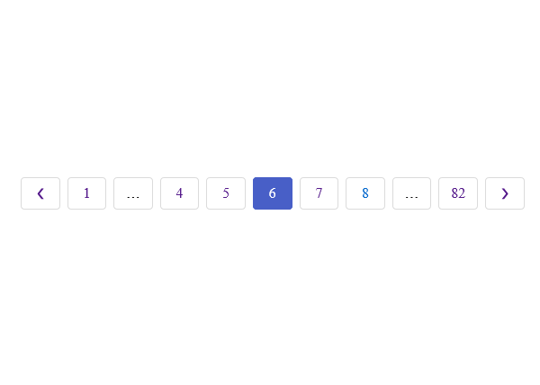
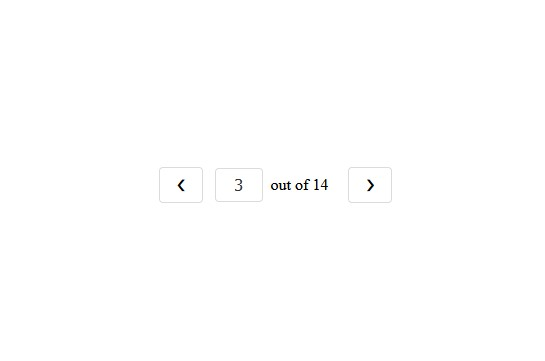
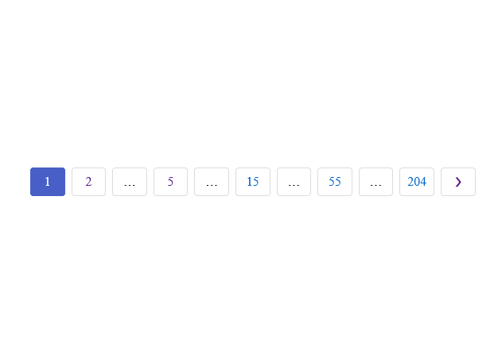

# Plugin usage

## Outputting pagination

To output the pagination widget, you can use the code below:

```twig
{# craft paginate twig tag #}

{# plugin function #}
{{craft.pagination.getPagination(pageInfo, {
        type: 'ellipsis',
}).render() }}
```

The first parameter of `getPagination()` function is `pageInfo` object returned by Craft [paginate](https://craftcms.com/docs/2.x/templating/paginate.html) Twig tag. The second parameter is optional - an object containing options determining various aspects of the pagination widget. You can see list of all options in the "[Pagination options](Options)" section of the plugin documentation.

By default, when using `getPagination()` method, plugin will include default CSS styles. You can disable them and use your own styles by setting `includeDefaultCss` option to `false` in options object passed to `getPagination()` function.

This is how pagination looks like with the default styling:



## Page number input widget

Pagination can include **Page number input widget** - input allowing the users to type in which page to visit instead of clicking through paginaton links. To include page number widget in your pagination, pass `showNumberWidget` param with `true` value to pagination options.

```twig

{{craft.pagination.getPagination(pageInfo, {
        showNumberWidget: true,
}).render() }}
```

Some developers might want to skip the regular page number links and just use page number input widget along with **next** and **previous** links. This can be done by using these options:

```twig

{{craft.pagination.getPagination(pageInfo, {
        showNumberWidget: true,
        showInactivePrevNext: true,
        showEllipsis: false,
        showNumbers: false,
}).render() }}
```

This is how the page number widget looks like:



## Logarithmic pagination

By default, pagination will output **ellipsis** type pagination - one displaying page links adjacent to the current page number. 

You can also use the **logarithmic** pagination - displaying page links in the groups with numbers incrementing on a logarithmic scale. This type of pagination is very useful for content lists with the large number of subpages.

```twig

{{craft.pagination.getPagination(pageInfo, {
        type: 'logarithmic',
        groups: 6,
}).render() }}
```

This is how logarithmic pagination looks like. Note that you can see 6 numeric links - because we set `groups` param to 6. This parameter is specific only to logarithmic pagination.



## Manual rendering of the pagination

The simplest method of outputting the pagination widget is using `render()`  method. You can however access any attributes of the pagination widget object and use them in your own template. For example, here we are accessing list of pagination links using `getLinks()` method of the pagination object and we loop through them:

```twig



<div class="some-custom-pagination">

        <a href="{{link.url}}">{{link.content}}</a>

</div>
```

If you want to create your own pagination widget template, you can check plugin template files to see variable names and such.

## SEO tags

By default, plugin will insert `<link rel="prev">` and `<link rel="next`> tags into the template. This also works properly if the **Seomatic** plugin is installed. You can disable this behavior by setting `addSeoTags` option to `false` in options object passed to `getPagination()` function.